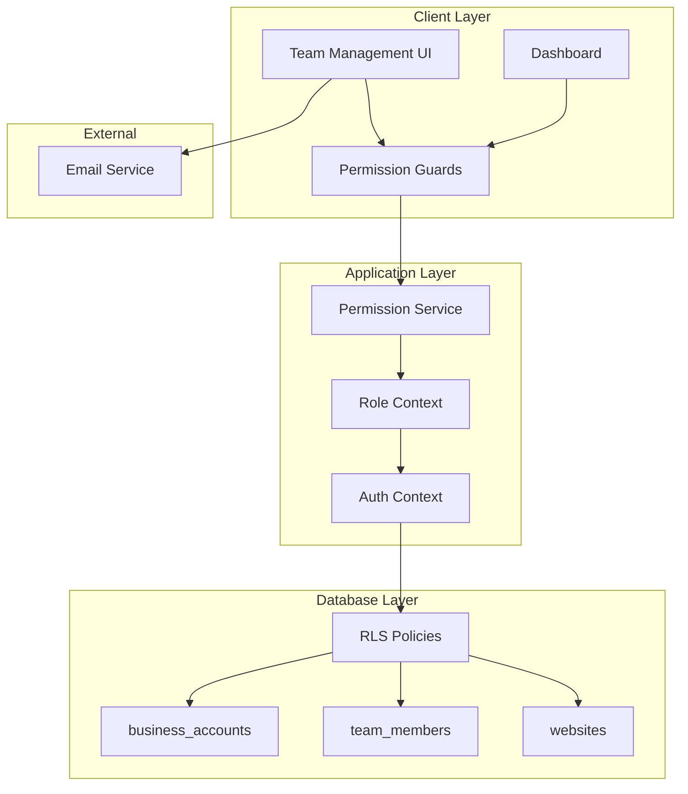

# Design Document

## Overview

The role-based access control (RBAC) system introduces a multi-tenant architecture to SiteHelper, enabling businesses to manage team access with three distinct permission levels: Owner, Admin, and Editor. This design extends the existing single-user model to support collaborative teams while maintaining data isolation and security through database-level enforcement.

The implementation leverages Supabase's Row-Level Security (RLS) policies for backend enforcement, React Context for frontend state management, and a new business account abstraction to group users and resources.

## Architecture

### High-Level Architecture



### Data Model Changes

The RBAC system introduces a business account layer that sits between users and their resources:

**Before RBAC:**
```
auth.users (1) -----> (N) websites -----> (N) conversations
```

**After RBAC:**
```
auth.users (N) -----> (1) business_accounts (1) -----> (N) websites -----> (N) conversations
                              |
                              v
                        team_members (N)
```

## Components and Interfaces

### Database Schema Changes

#### 1. New Tables

**business_accounts table:**
```sql
CREATE TABLE business_accounts (
  id uuid PRIMARY KEY DEFAULT gen_random_uuid(),
  name text NOT NULL,
  owner_id uuid NOT NULL REFERENCES auth.users(id) ON DELETE CASCADE,
  created_at timestamptz DEFAULT now(),
  updated_at timestamptz DEFAULT now(),
  UNIQUE(owner_id)
);
```

**team_members table:**
```sql
CREATE TABLE team_members (
  id uuid PRIMARY KEY DEFAULT gen_random_uuid(),
  business_account_id uuid NOT NULL REFERENCES business_accounts(id) ON DELETE CASCADE,
  user_id uuid NOT NULL REFERENCES auth.users(id) ON DELETE CASCADE,
  role text NOT NULL CHECK (role IN ('owner', 'admin', 'editor')),
  invited_by uuid REFERENCES auth.users(id),
  invited_at timestamptz DEFAULT now(),
  joined_at timestamptz,
  status text NOT NULL DEFAULT 'active' CHECK (status IN ('active', 'invited', 'suspended')),
  UNIQUE(business_account_id, user_id)
);
```

**invitations table:**
```sql
CREATE TABLE invitations (
  id uuid PRIMARY KEY DEFAULT gen_random_uuid(),
  business_account_id uuid NOT NULL REFERENCES business_accounts(id) ON DELETE CASCADE,
  email text NOT NULL,
  role text NOT NULL CHECK (role IN ('admin', 'editor')),
  invited_by uuid NOT NULL REFERENCES auth.users(id),
  token text NOT NULL UNIQUE,
  expires_at timestamptz NOT NULL,
  accepted_at timestamptz,
  created_at timestamptz DEFAULT now(),
  status text NOT NULL DEFAULT 'pending' CHECK (status IN ('pending', 'accepted', 'expired', 'revoked'))
);
```

**audit_logs table:**
```sql
CREATE TABLE audit_logs (
  id uuid PRIMARY KEY DEFAULT gen_random_uuid(),
  business_account_id uuid NOT NULL REFERENCES business_accounts(id) ON DELETE CASCADE,
  user_id uuid NOT NULL REFERENCES auth.users(id),
  action text NOT NULL,
  resource_type text NOT NULL,
  resource_id uuid,
  details jsonb DEFAULT '{}',
  created_at timestamptz DEFAULT now()
);
```

#### 2. Modified Tables

**websites table - Add business_account_id:**
```sql
ALTER TABLE websites 
  ADD COLUMN business_account_id uuid REFERENCES business_accounts(id) ON DELETE CASCADE;

-- Migrate existing data
UPDATE websites 
SET business_account_id = (
  SELECT id FROM business_accounts WHERE owner_id = websites.user_id
);

-- Make it required after migration
ALTER TABLE websites ALTER COLUMN business_account_id SET NOT NULL;

-- Remove user_id column (replaced by business_account_id)
ALTER TABLE websites DROP COLUMN user_id;
```

#### 3. Indexes

```sql
CREATE INDEX idx_team_members_business_account ON team_members(business_account_id);
CREATE INDEX idx_team_members_user ON team_members(user_id);
CREATE INDEX idx_team_members_role ON team_members(role);
CREATE INDEX idx_invitations_token ON invitations(token);
CREATE INDEX idx_invitations_email ON invitations(email);
CREATE INDEX idx_audit_logs_business_account ON audit_logs(business_account_id);
CREATE INDEX idx_audit_logs_user ON audit_logs(user_id);
CREATE INDEX idx_websites_business_account ON websites(business_account_id);
```

### Row-Level Security Policies

#### Business Accounts Policies

```sql
-- Team members can view their business account
CREATE POLICY "Team members can view business account"
  ON business_accounts FOR SELECT
  TO authenticated
  USING (
    id IN (
      SELECT business_account_id FROM team_members 
      WHERE user_id = auth.uid() AND status = 'active'
    )
  );

-- Only owners can update business account
CREATE POLICY "Owners can update business account"
  ON business_accounts FOR UPDATE
  TO authenticated
  USING (owner_id = auth.uid())
  WITH CHECK (owner_id = auth.uid());

-- Only owners can delete business account
CREATE POLICY "Owners can delete business account"
  ON business_accounts FOR DELETE
  TO authenticated
  USING (owner_id = auth.uid());
```

#### Team Members Policies

```sql
-- Team members can view other team members in their account
CREATE POLICY "Team members can view team"
  ON team_members FOR SELECT
  TO authenticated
  USING (
    business_account_id IN (
      SELECT business_account_id FROM team_members 
      WHERE user_id = auth.uid() AND status = 'active'
    )
  );

-- Owners and admins can add team members
CREATE POLICY "Owners and admins can add team members"
  ON team_members FOR INSERT
  TO authenticated
  WITH CHECK (
    business_account_id IN (
      SELECT business_account_id FROM team_members 
      WHERE user_id = auth.uid() 
      AND role IN ('owner', 'admin')
      AND status = 'active'
    )
  );

-- Owners and admins can update team members
CREATE POLICY "Owners and admins can update team members"
  ON team_members FOR UPDATE
  TO authenticated
  USING (
    business_account_id IN (
      SELECT tm.business_account_id FROM team_members tm
      WHERE tm.user_id = auth.uid() 
      AND tm.role IN ('owner', 'admin')
      AND tm.status = 'active'
    )
  );

-- Owners and admins can remove team members
CREATE POLICY "Owners and admins can remove team members"
  ON team_members FOR DELETE
  TO authenticated
  USING (
    business_account_id IN (
      SELECT tm.business_account_id FROM team_members tm
      WHERE tm.user_id = auth.uid() 
      AND tm.role IN ('owner', 'admin')
      AND tm.status = 'active'
    )
    AND role != 'owner' -- Cannot delete owner
  );
```

#### Websites Policies (Updated)

```sql
-- Team members can view websites in their business account
CREATE POLICY "Team members can view websites"
  ON websites FOR SELECT
  TO authenticated
  USING (
    business_account_id IN (
      SELECT business_account_id FROM team_members 
      WHERE user_id = auth.uid() AND status = 'active'
    )
  );

-- Owners and admins can add websites
CREATE POLICY "Owners and admins can add websites"
  ON websites FOR INSERT
  TO authenticated
  WITH CHECK (
    business_account_id IN (
      SELECT business_account_id FROM team_members 
      WHERE user_id = auth.uid() 
      AND role IN ('owner', 'admin')
      AND status = 'active'
    )
  );

-- Owners and admins can update websites
CREATE POLICY "Owners and admins can update websites"
  ON websites FOR UPDATE
  TO authenticated
  USING (
    business_account_id IN (
      SELECT business_account_id FROM team_members 
      WHERE user_id = auth.uid() 
      AND role IN ('owner', 'admin')
      AND status = 'active'
    )
  );

-- Owners and admins can delete websites
CREATE POLICY "Owners and admins can delete websites"
  ON websites FOR DELETE
  TO authenticated
  USING (
    business_account_id IN (
      SELECT business_account_id FROM team_members 
      WHERE user_id = auth.uid() 
      AND role IN ('owner', 'admin')
      AND status = 'active'
    )
  );
```

#### Knowledge Bases Policies (Updated)

```sql
-- All team members can view knowledge bases
CREATE POLICY "Team members can view knowledge bases"
  ON knowledge_bases FOR SELECT
  TO authenticated
  USING (
    website_id IN (
      SELECT w.id FROM websites w
      JOIN team_members tm ON tm.business_account_id = w.business_account_id
      WHERE tm.user_id = auth.uid() AND tm.status = 'active'
    )
  );

-- All team members can update knowledge bases
CREATE POLICY "Team members can update knowledge bases"
  ON knowledge_bases FOR UPDATE
  TO authenticated
  USING (
    website_id IN (
      SELECT w.id FROM websites w
      JOIN team_members tm ON tm.business_account_id = w.business_account_id
      WHERE tm.user_id = auth.uid() AND tm.status = 'active'
    )
  );

-- Only owners and admins can delete knowledge bases
CREATE POLICY "Owners and admins can delete knowledge bases"
  ON knowledge_bases FOR DELETE
  TO authenticated
  USING (
    website_id IN (
      SELECT w.id FROM websites w
      JOIN team_members tm ON tm.business_account_id = w.business_account_id
      WHERE tm.user_id = auth.uid() 
      AND tm.role IN ('owner', 'admin')
      AND tm.status = 'active'
    )
  );
```

#### Conversations Policies (Updated)

```sql
-- All team members can view conversations
CREATE POLICY "Team members can view conversations"
  ON conversations FOR SELECT
  TO authenticated
  USING (
    website_id IN (
      SELECT w.id FROM websites w
      JOIN team_members tm ON tm.business_account_id = w.business_account_id
      WHERE tm.user_id = auth.uid() AND tm.status = 'active'
    )
  );

-- Owners and admins can delete conversations
CREATE POLICY "Owners and admins can delete conversations"
  ON conversations FOR DELETE
  TO authenticated
  USING (
    website_id IN (
      SELECT w.id FROM websites w
      JOIN team_members tm ON tm.business_account_id = w.business_account_id
      WHERE tm.user_id = auth.uid() 
      AND tm.role IN ('owner', 'admin')
      AND tm.status = 'active'
    )
  );
```

### Frontend Components

#### 1. Permission Service

**Purpose:** Centralized permission checking logic

```typescript
// services/permissions.ts

export type Role = 'owner' | 'admin' | 'editor';

export type Permission = 
  | 'view_websites'
  | 'manage_websites'
  | 'view_knowledge_bases'
  | 'edit_knowledge_bases'
  | 'delete_knowledge_bases'
  | 'view_conversations'
  | 'delete_conversations'
  | 'view_team'
  | 'manage_team'
  | 'manage_billing'
  | 'delete_account'
  | 'view_audit_logs';

const rolePermissions: Record<Role, Permission[]> = {
  owner: [
    'view_websites',
    'manage_websites',
    'view_knowledge_bases',
    'edit_knowledge_bases',
    'delete_knowledge_bases',
    'view_conversations',
    'delete_conversations',
    'view_team',
    'manage_team',
    'manage_billing',
    'delete_account',
    'view_audit_logs',
  ],
  admin: [
    'view_websites',
    'manage_websites',
    'view_knowledge_bases',
    'edit_knowledge_bases',
    'delete_knowledge_bases',
    'view_conversations',
    'delete_conversations',
    'view_team',
    'manage_team',
  ],
  editor: [
    'view_knowledge_bases',
    'edit_knowledge_bases',
    'view_conversations',
  ],
};

export function hasPermission(role: Role, permission: Permission): boolean {
  return rolePermissions[role].includes(permission);
}

export function canManageRole(userRole: Role, targetRole: Role): boolean {
  if (userRole === 'owner') return true;
  if (userRole === 'admin' && targetRole !== 'owner') return true;
  return false;
}
```

#### 2. Team Context

**Purpose:** Provide team member and role information throughout the app

```typescript
// contexts/TeamContext.tsx

interface TeamMember {
  id: string;
  user_id: string;
  business_account_id: string;
  role: Role;
  status: 'active' | 'invited' | 'suspended';
  invited_at: string;
  joined_at?: string;
}

interface BusinessAccount {
  id: string;
  name: string;
  owner_id: string;
}

interface TeamContextType {
  currentMember: TeamMember | null;
  businessAccount: BusinessAccount | null;
  teamMembers: TeamMember[];
  loading: boolean;
  hasPermission: (permission: Permission) => boolean;
  canManageRole: (targetRole: Role) => boolean;
  refreshTeam: () => Promise<void>;
}

export function TeamProvider({ children }: { children: React.ReactNode }) {
  const { user } = useAuth();
  const [currentMember, setCurrentMember] = useState<TeamMember | null>(null);
  const [businessAccount, setBusinessAccount] = useState<BusinessAccount | null>(null);
  const [teamMembers, setTeamMembers] = useState<TeamMember[]>([]);
  const [loading, setLoading] = useState(true);

  // Load current user's team member record and business account
  useEffect(() => {
    if (user) {
      loadTeamData();
    }
  }, [user]);

  const hasPermission = (permission: Permission) => {
    if (!currentMember) return false;
    return hasPermission(currentMember.role, permission);
  };

  const canManageRole = (targetRole: Role) => {
    if (!currentMember) return false;
    return canManageRole(currentMember.role, targetRole);
  };

  // ... implementation
}
```

#### 3. Permission Guard Component

**Purpose:** Conditionally render UI based on permissions

```typescript
// components/PermissionGuard.tsx

interface PermissionGuardProps {
  permission: Permission;
  fallback?: React.ReactNode;
  children: React.ReactNode;
}

export function PermissionGuard({ 
  permission, 
  fallback = null, 
  children 
}: PermissionGuardProps) {
  const { hasPermission } = useTeam();

  if (!hasPermission(permission)) {
    return <>{fallback}</>;
  }

  return <>{children}</>;
}

// Usage example:
<PermissionGuard permission="manage_websites">
  <button onClick={deleteWebsite}>Delete Website</button>
</PermissionGuard>
```

#### 4. Team Management Component

**Purpose:** UI for managing team members

**Features:**
- List all team members with roles
- Invite new team members
- Change team member roles
- Remove team members
- Display pending invitations

```typescript
// components/TeamManagement.tsx

export function TeamManagement() {
  const { teamMembers, currentMember, hasPermission } = useTeam();
  const [inviteEmail, setInviteEmail] = useState('');
  const [inviteRole, setInviteRole] = useState<'admin' | 'editor'>('editor');

  const handleInvite = async () => {
    // Call invitation edge function
  };

  const handleRoleChange = async (memberId: string, newRole: Role) => {
    // Update team member role
  };

  const handleRemove = async (memberId: string) => {
    // Remove team member
  };

  return (
    <div>
      <h2>Team Members</h2>
      
      {hasPermission('manage_team') && (
        <InviteForm 
          onInvite={handleInvite}
          email={inviteEmail}
          setEmail={setInviteEmail}
          role={inviteRole}
          setRole={setInviteRole}
        />
      )}

      <TeamMemberList
        members={teamMembers}
        currentMember={currentMember}
        onRoleChange={handleRoleChange}
        onRemove={handleRemove}
      />
    </div>
  );
}
```

#### 5. Updated Dashboard Navigation

**Purpose:** Show/hide navigation items based on role

```typescript
// components/Dashboard.tsx (updated)

export function Dashboard() {
  const { hasPermission } = useTeam();
  const [activeTab, setActiveTab] = useState<Tab>('websites');

  const tabs = [
    { 
      id: 'websites', 
      label: 'Websites', 
      icon: Globe,
      permission: 'view_websites' as Permission
    },
    { 
      id: 'conversations', 
      label: 'Conversations', 
      icon: MessageSquare,
      permission: 'view_conversations' as Permission
    },
    { 
      id: 'team', 
      label: 'Team', 
      icon: Users,
      permission: 'view_team' as Permission
    },
    { 
      id: 'settings', 
      label: 'Settings', 
      icon: Settings,
      permission: null // Always visible
    },
  ];

  const visibleTabs = tabs.filter(tab => 
    !tab.permission || hasPermission(tab.permission)
  );

  return (
    <div>
      <nav>
        {visibleTabs.map(tab => (
          <button key={tab.id} onClick={() => setActiveTab(tab.id)}>
            {tab.label}
          </button>
        ))}
      </nav>
      {/* Tab content */}
    </div>
  );
}
```

### Backend Components

#### 1. Invitation Edge Function

**Purpose:** Send invitation emails and create invitation records

```typescript
// supabase/functions/send-invitation/index.ts

interface InvitationRequest {
  email: string;
  role: 'admin' | 'editor';
  businessAccountId: string;
}

Deno.serve(async (req: Request) => {
  const { email, role, businessAccountId } = await req.json();
  
  // Verify requester has permission
  const { data: requester } = await supabase
    .from('team_members')
    .select('role')
    .eq('user_id', req.headers.get('user-id'))
    .eq('business_account_id', businessAccountId)
    .single();

  if (!requester || !['owner', 'admin'].includes(requester.role)) {
    return new Response(JSON.stringify({ error: 'Unauthorized' }), {
      status: 403
    });
  }

  // Create invitation
  const token = crypto.randomUUID();
  const expiresAt = new Date(Date.now() + 7 * 24 * 60 * 60 * 1000); // 7 days

  const { data: invitation } = await supabase
    .from('invitations')
    .insert({
      business_account_id: businessAccountId,
      email,
      role,
      invited_by: req.headers.get('user-id'),
      token,
      expires_at: expiresAt.toISOString(),
    })
    .select()
    .single();

  // Send email
  const inviteLink = `${Deno.env.get('APP_URL')}/accept-invite/${token}`;
  
  await sendEmail({
    to: email,
    subject: 'You\'ve been invited to join a team on SiteHelper',
    html: `
      <p>You've been invited to join a team on SiteHelper as ${role}.</p>
      <p><a href="${inviteLink}">Accept Invitation</a></p>
      <p>This invitation expires in 7 days.</p>
    `
  });

  return new Response(JSON.stringify({ success: true, invitation }), {
    status: 200
  });
});
```

#### 2. Accept Invitation Edge Function

**Purpose:** Process invitation acceptance and create team member

```typescript
// supabase/functions/accept-invitation/index.ts

Deno.serve(async (req: Request) => {
  const { token, userId } = await req.json();

  // Verify invitation
  const { data: invitation } = await supabase
    .from('invitations')
    .select('*')
    .eq('token', token)
    .eq('status', 'pending')
    .single();

  if (!invitation) {
    return new Response(JSON.stringify({ error: 'Invalid invitation' }), {
      status: 404
    });
  }

  if (new Date(invitation.expires_at) < new Date()) {
    await supabase
      .from('invitations')
      .update({ status: 'expired' })
      .eq('id', invitation.id);
    
    return new Response(JSON.stringify({ error: 'Invitation expired' }), {
      status: 400
    });
  }

  // Create team member
  await supabase
    .from('team_members')
    .insert({
      business_account_id: invitation.business_account_id,
      user_id: userId,
      role: invitation.role,
      invited_by: invitation.invited_by,
      invited_at: invitation.created_at,
      joined_at: new Date().toISOString(),
      status: 'active',
    });

  // Mark invitation as accepted
  await supabase
    .from('invitations')
    .update({ 
      status: 'accepted',
      accepted_at: new Date().toISOString()
    })
    .eq('id', invitation.id);

  return new Response(JSON.stringify({ success: true }), {
    status: 200
  });
});
```

#### 3. Audit Logging Utility

**Purpose:** Create audit log entries for sensitive operations

```typescript
// supabase/functions/_shared/audit.ts

export async function createAuditLog(
  supabase: SupabaseClient,
  businessAccountId: string,
  userId: string,
  action: string,
  resourceType: string,
  resourceId?: string,
  details?: Record<string, any>
) {
  await supabase
    .from('audit_logs')
    .insert({
      business_account_id: businessAccountId,
      user_id: userId,
      action,
      resource_type: resourceType,
      resource_id: resourceId,
      details: details || {},
    });
}

// Usage in other functions:
await createAuditLog(
  supabase,
  businessAccountId,
  userId,
  'website_created',
  'website',
  websiteId,
  { name: websiteName, url: websiteUrl }
);
```

## Data Models

### TypeScript Interfaces

```typescript
interface BusinessAccount {
  id: string;
  name: string;
  owner_id: string;
  created_at: string;
  updated_at: string;
}

interface TeamMember {
  id: string;
  business_account_id: string;
  user_id: string;
  role: 'owner' | 'admin' | 'editor';
  invited_by?: string;
  invited_at: string;
  joined_at?: string;
  status: 'active' | 'invited' | 'suspended';
}

interface Invitation {
  id: string;
  business_account_id: string;
  email: string;
  role: 'admin' | 'editor';
  invited_by: string;
  token: string;
  expires_at: string;
  accepted_at?: string;
  created_at: string;
  status: 'pending' | 'accepted' | 'expired' | 'revoked';
}

interface AuditLog {
  id: string;
  business_account_id: string;
  user_id: string;
  action: string;
  resource_type: string;
  resource_id?: string;
  details: Record<string, any>;
  created_at: string;
}
```

## Migration Strategy

### Phase 1: Database Migration

1. Create new tables (business_accounts, team_members, invitations, audit_logs)
2. Add business_account_id to websites table
3. Create migration script to:
   - Create business account for each existing user
   - Create team_member record with 'owner' role for each user
   - Update websites to reference business_account_id
4. Drop user_id column from websites
5. Update RLS policies

### Phase 2: Backend Updates

1. Update edge functions to use business_account_id
2. Add invitation functions
3. Add audit logging to sensitive operations
4. Update existing RLS policies

### Phase 3: Frontend Updates

1. Add TeamContext and permission service
2. Update Dashboard navigation
3. Add Team Management UI
4. Add PermissionGuard components throughout app
5. Update WebsiteList to use business account context

### Phase 4: Testing & Rollout

1. Test with multiple roles
2. Verify data isolation
3. Test invitation flow
4. Verify audit logging
5. Deploy to production

## Error Handling

### Permission Errors

**Frontend:**
- Display toast notification with clear message
- Suggest contacting Owner/Admin
- Log attempt for security monitoring

**Backend:**
- Return 403 Forbidden with descriptive error
- Log unauthorized access attempts
- Don't expose sensitive system information

### Invitation Errors

- Expired invitations: Clear message with option to request new invite
- Invalid token: Redirect to login with error message
- Already accepted: Redirect to dashboard
- Email already in use: Suggest signing in instead

## Security Considerations

### Multi-Tenant Isolation

- All queries filtered by business_account_id
- RLS policies enforce at database level
- No cross-account data leakage
- Cascade deletes maintain referential integrity

### Role Enforcement

- Backend RLS policies as primary enforcement
- Frontend guards for UX only (not security)
- API endpoints verify permissions
- Audit logging for accountability

### Invitation Security

- Unique tokens with expiration
- Single-use invitations
- Email verification
- Revocation capability

## Testing Strategy

### Unit Tests

- Permission service logic
- Role hierarchy validation
- TeamContext state management
- Invitation token generation

### Integration Tests

- RLS policy enforcement
- Cross-role data access
- Invitation flow end-to-end
- Audit log creation

### Manual Testing

- Test each role's access
- Verify UI shows/hides correctly
- Test invitation acceptance
- Verify data isolation
- Test ownership transfer

## Performance Considerations

- Index on business_account_id for fast filtering
- Cache team member data in context
- Lazy load audit logs
- Optimize RLS policy queries with proper indexes

## Future Enhancements

- Viewer role (read-only access)
- Custom roles with granular permissions
- Team activity feed
- Role-based email notifications
- SSO integration
- API key management per role
