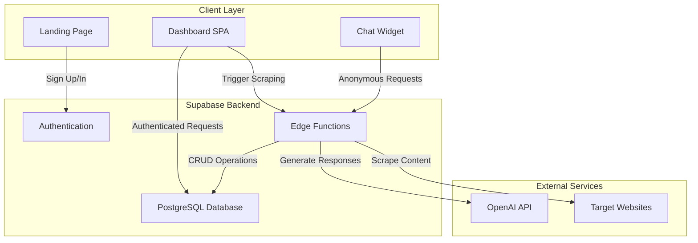

# Design Document

## Overview

SiteHelper is a full-stack web application that provides AI-powered customer support through embeddable chat widgets. The system consists of a React-based dashboard for business owners, Supabase backend services for data management and serverless functions, and a standalone chat widget component that can be embedded on any website.

The architecture follows a serverless model with edge functions handling business logic, PostgreSQL for data persistence, and OpenAI's GPT-4o-mini for natural language processing.

## Architecture

### High-Level Architecture



### Technology Stack

**Frontend:**
- React 18.3 with TypeScript
- Vite for build tooling
- Tailwind CSS for styling
- Lucide React for icons
- Supabase JS client for API communication

**Backend:**
- Supabase (PostgreSQL + Edge Functions)
- Deno runtime for serverless functions
- Row-Level Security (RLS) for data isolation

**External Services:**
- OpenAI GPT-4o-mini for chat responses
- Target websites for content scraping

## Components and Interfaces

### Frontend Components

#### 1. Landing Page Component
**Purpose:** Marketing page for unauthenticated users

**Key Features:**
- Hero section with value proposition
- Feature grid showcasing capabilities
- Call-to-action buttons
- Responsive design

**State Management:**
- Local state for navigation between landing and auth form

#### 2. Authentication Component
**Purpose:** User registration and login

**Integration:**
- Supabase Auth for email/password authentication
- Context provider for global auth state
- Automatic redirect on successful authentication

#### 3. Dashboard Component
**Purpose:** Main application interface for business owners

**Sub-components:**
- Navigation bar with user info and sign-out
- Tab navigation (Websites, Conversations, Settings)
- WebsiteList component
- ConversationList component

**State Management:**
- Active tab selection
- User context from AuthProvider

#### 4. WebsiteList Component
**Purpose:** Display and manage registered websites

**Features:**
- List view of all user websites
- Add new website form
- Website status indicators (pending, processing, completed, failed)
- Delete website functionality
- Widget code generation and display

**Data Flow:**
- Fetch websites on mount
- Real-time updates via Supabase subscriptions
- Trigger scraping function on website creation

#### 5. ConversationList Component
**Purpose:** View visitor conversations

**Features:**
- List of all conversations across websites
- Filter by website
- Message history display
- Timestamp formatting

**Data Flow:**
- Fetch conversations with related messages
- Join with websites table for context

#### 6. SiteHelperWidget Component
**Purpose:** Embeddable chat interface for website visitors

**Props:**
- `websiteId`: Unique identifier for the website
- `apiUrl`: Supabase project URL
- `theme`: Light or dark mode
- `primaryColor`: Brand color for styling
- `position`: Widget placement (bottom-right/bottom-left)
- `greeting`: Initial message from assistant

**State Management:**
- Open/closed state
- Message history
- Loading state
- Conversation ID
- Visitor ID (persisted in localStorage)

**Features:**
- Floating action button
- Expandable chat window
- Message input with keyboard support
- Auto-scroll to latest message
- Loading animation
- Error handling

### Backend Components

#### 1. Database Schema

**websites table:**
```sql
- id: uuid (PK)
- user_id: uuid (FK to auth.users)
- name: text
- url: text
- status: text (pending|processing|completed|failed)
- scrape_error: text
- widget_config: jsonb
- created_at: timestamptz
- updated_at: timestamptz
```

**knowledge_bases table:**
```sql
- id: uuid (PK)
- website_id: uuid (FK to websites)
- content: text
- summary: text
- metadata: jsonb
- created_at: timestamptz
- updated_at: timestamptz
```

**conversations table:**
```sql
- id: uuid (PK)
- website_id: uuid (FK to websites)
- visitor_id: text
- started_at: timestamptz
- last_message_at: timestamptz
- metadata: jsonb
```

**messages table:**
```sql
- id: uuid (PK)
- conversation_id: uuid (FK to conversations)
- role: text (user|assistant)
- content: text
- created_at: timestamptz
```

**Indexes:**
- idx_websites_user_id
- idx_knowledge_bases_website_id
- idx_conversations_website_id
- idx_messages_conversation_id

#### 2. Edge Functions

**scrape-website Function:**

**Purpose:** Extract content from target websites

**Input:**
```typescript
{
  websiteId: string,
  url: string
}
```

**Process:**
1. Update website status to "processing"
2. Fetch HTML from target URL
3. Strip script and style tags
4. Remove HTML markup
5. Normalize whitespace
6. Truncate to 10,000 characters
7. Update knowledge_bases table
8. Update website status to "completed" or "failed"

**Output:**
```typescript
{
  success: boolean,
  content: string,
  error?: string
}
```

**Error Handling:**
- Network failures
- Invalid URLs
- HTTP error responses
- Timeout handling

**chat-assistant Function:**

**Purpose:** Generate AI responses to visitor questions

**Input:**
```typescript
{
  websiteId: string,
  conversationId?: string,
  message: string,
  visitorId: string
}
```

**Process:**
1. Create or retrieve conversation
2. Store user message
3. Fetch knowledge base content
4. Construct OpenAI prompt with knowledge base
5. Call OpenAI API
6. Store assistant response
7. Update conversation timestamp

**Output:**
```typescript
{
  conversationId: string,
  message: string
}
```

**AI Prompt Structure:**
```
System: You are a helpful customer service assistant for a website. 
Use the following knowledge base to answer questions accurately.

Knowledge Base Summary: [summary]
Knowledge Base Content: [content up to 8000 chars]

If you don't know the answer, politely say so.
Keep responses brief and conversational.

User: [user message]
```

**OpenAI Configuration:**
- Model: gpt-4o-mini
- Temperature: 0.7
- Max tokens: 500

## Data Models

### Website Model
```typescript
interface Website {
  id: string;
  user_id: string;
  name: string;
  url: string;
  status: 'pending' | 'processing' | 'completed' | 'failed';
  scrape_error?: string;
  widget_config: {
    theme: 'light' | 'dark';
    primaryColor: string;
    position: 'bottom-right' | 'bottom-left';
    greeting: string;
  };
  created_at: string;
  updated_at: string;
}
```

### Knowledge Base Model
```typescript
interface KnowledgeBase {
  id: string;
  website_id: string;
  content: string;
  summary: string;
  metadata: {
    url?: string;
    scraped_at?: string;
    [key: string]: any;
  };
  created_at: string;
  updated_at: string;
}
```

### Conversation Model
```typescript
interface Conversation {
  id: string;
  website_id: string;
  visitor_id: string;
  started_at: string;
  last_message_at: string;
  metadata: {
    browser?: string;
    location?: string;
    [key: string]: any;
  };
}
```

### Message Model
```typescript
interface Message {
  id: string;
  conversation_id: string;
  role: 'user' | 'assistant';
  content: string;
  created_at: string;
}
```

## Error Handling

### Frontend Error Handling

**Authentication Errors:**
- Display inline error messages
- Clear form on invalid credentials
- Session timeout handling

**API Errors:**
- Toast notifications for user feedback
- Retry logic for transient failures
- Graceful degradation

**Widget Errors:**
- Fallback messages for API failures
- Network error detection
- Timeout handling with user feedback

### Backend Error Handling

**Scraping Errors:**
- Store error message in database
- Update status to "failed"
- Log detailed error for debugging

**Chat Assistant Errors:**
- Return fallback message to user
- Log OpenAI API errors
- Handle missing API key gracefully

**Database Errors:**
- Transaction rollback on failures
- Constraint violation handling
- Connection pool management

### Security Considerations

**Row-Level Security (RLS):**
- Authenticated users can only access their own websites
- Knowledge bases inherit website ownership
- Conversations and messages accessible to website owners
- Anonymous users can create conversations and messages

**API Security:**
- CORS headers configured for cross-origin requests
- Service role key used for privileged operations
- Anonymous access limited to chat functionality
- Rate limiting (handled by Supabase)

**Data Privacy:**
- Visitor IDs are anonymous client-generated strings
- No PII collected from visitors
- Cascade delete on user account removal

## Testing Strategy

### Unit Testing

**Frontend Components:**
- Component rendering tests
- User interaction tests
- State management tests
- Props validation

**Backend Functions:**
- Input validation tests
- Business logic tests
- Error handling tests
- Mock external API calls

### Integration Testing

**API Integration:**
- Supabase client integration
- OpenAI API integration
- Database query tests
- RLS policy verification

**End-to-End Flows:**
- User registration and login
- Website creation and scraping
- Chat widget interaction
- Conversation viewing

### Manual Testing

**Browser Compatibility:**
- Chrome, Firefox, Safari, Edge
- Mobile responsive design
- Widget embedding on various sites

**Performance Testing:**
- Large knowledge base handling
- Multiple concurrent conversations
- Widget load time
- API response times

### Test Data

**Mock Websites:**
- Valid URLs with various content types
- Invalid URLs for error testing
- Large websites for performance testing

**Mock Conversations:**
- Various question types
- Edge cases (empty messages, very long messages)
- Multiple concurrent visitors

## Deployment Architecture

**Frontend Deployment:**
- Static site hosting (Vercel, Netlify, or similar)
- CDN for global distribution
- Environment variables for Supabase configuration

**Backend Deployment:**
- Supabase managed infrastructure
- Edge functions deployed to Supabase
- Database migrations version controlled

**Environment Variables:**
- `SUPABASE_URL`: Supabase project URL
- `SUPABASE_ANON_KEY`: Public API key
- `SUPABASE_SERVICE_ROLE_KEY`: Privileged API key (server-only)
- `OPENAI_API_KEY`: OpenAI API authentication

## Future Enhancements

**Potential Improvements:**
- Multi-page website scraping (crawling)
- Vector embeddings for semantic search
- Conversation analytics dashboard
- Custom AI training on specific content
- Multi-language support
- Live chat handoff to human agents
- Widget analytics (views, interactions)
- A/B testing for widget configurations
